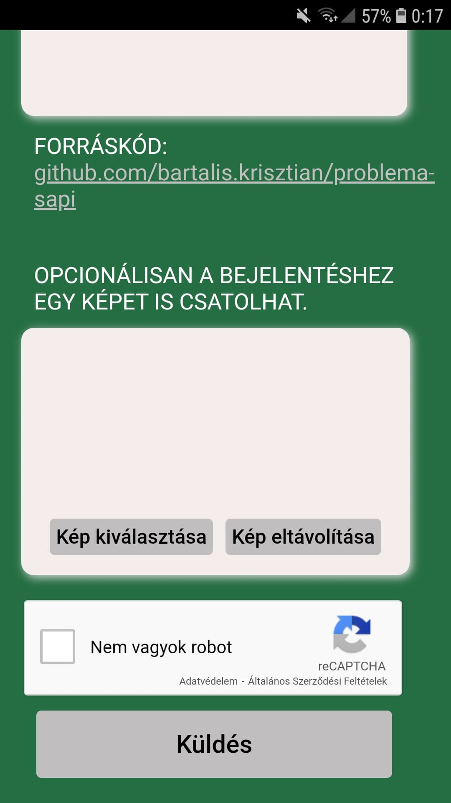

# University project for final exam

## Goal

To help SAPIENTIA UNIVERSITY students report their problems/comments anonymously via text and image too.
These reports will be forwarded towards the university teachers/management and hopefully help the problem solving and communication between the students and university.

## About the project

* This project is a frontend website written in reactJS.
* The uploaded reports are stored in Firebase cloud storage.
* The site is secured with Google reCAPTCHA v2, to prevent bot attacks.

### Desktop

### Mobile

